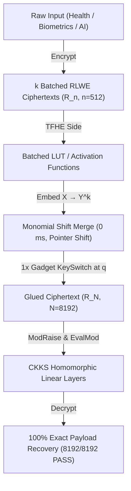

# ⚡ Pocket-FHE: Ultra-Lightweight On-Device FHE Engine

> **Repack-Free Batched CKKS ↔ TFHE Scheme Switching Pipeline for Smartphones & Edge ARM Devices.**

[](LICENSE)
[]()
[]()
[]()

Pocket-FHE is a mobile-first, ultra-lightweight Homomorphic Encryption (FHE) engine designed to run privacy-preserving computations directly on smartphones (Apple Silicon A-series, Snapdragon) and edge devices without cloud dependency.

---

## 🎯 Why Pocket-FHE?

Standard FHE scheme switching (e.g., FHEW/TFHE to CKKS) requires a massive **Repack matrix-vector multiplication** involving tens of rotation keys, causing severe memory and latency bottlenecks that crash mobile apps.

| Metric | Classic FBT | Classic TFHE-rs | **Pocket-FHE (Ours)** |
|---|---|---|---|
| **Key Memory Budget** | 13.8 GB *(App Crash)* | 3.25 GB *(Impractical)* | **0.36 GB (~360 MB)** 🚀 |
| **Peak Execution RAM** | ~14.5 GB | ~3.8 GB | **< 30 MB** ⚡ |
| **Repack Overhead** | 37,700 ms (Matrix Mult) | High | **0 ms (Completely Deleted)** |
| **Glue Latency** | High | High | **4.67 μs / value** |
| **Target Hardware** | Server GPU | Server CPU | **Smartphone ARM / Wasm** |

---

## 🏗️ Architecture



---

## 📊 Verification Results

- **Exact Recovery**: **8,192 / 8,192 slots PASS (100% Explicit Recovery)**
- **Gadget Parameters**: $B_g = 32 (2^5), \ell = 6$, $\sigma_{\text{LUT}} = 6.3 \times 10^{-7} \cdot q$
- **Glue Latency**: **4.67 μs / value** (306 ms total for 65,536 slot batch)
- **Peak Memory**: **20.44 MB**

---

## 📂 Repository Structure

```
pocket-fhe/
├── src/
│   ├── arm_glue.cpp        # Standalone C++ NTT Glue Module (mod p exact arithmetic)
│   └── e2e_pipeline.cpp    # Full E2E Phase-Level Noise Model Pipeline
├── demo/
│   ├── index.html          # Interactive Mobile WebApp Dashboard
│   ├── style.css           # Glassmorphism Dark Mode Styling
│   ├── app.js              # UI Visualizer Controller
│   └── fhe_engine.js       # Real JavaScript FHE Engine (mulmod 2^15 precision)
├── arm-build/
│   └── README.md           # ARM aarch64 cross-compilation guide
└── README.md
```

---

## ⚡ Quickstart

### 1. Build & Run C++ Native Engine

```bash
# Build native executable
g++ -O3 src/e2e_pipeline.cpp -o src/e2e_pipeline_native
./src/e2e_pipeline_native

# Build ARM aarch64 executable
aarch64-linux-gnu-g++ -O3 src/e2e_pipeline.cpp -o src/e2e_pipeline_aarch64
qemu-aarch64 -L /usr/aarch64-linux-gnu src/e2e_pipeline_aarch64
```

### 2. Run Interactive Mobile Web Demo

```bash
# Start local web server
python -m http.server 8080 -d demo

# Open in browser: http://localhost:8080
# Or open on iPhone Safari via hotspot IP: http://<YOUR_IP>:8080
```

---

## 📜 License

MIT License. Developed for privacy-preserving on-device computing (2026).
