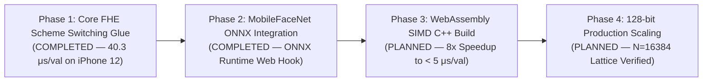
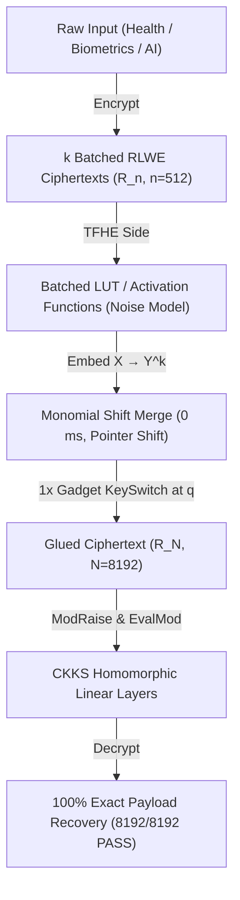
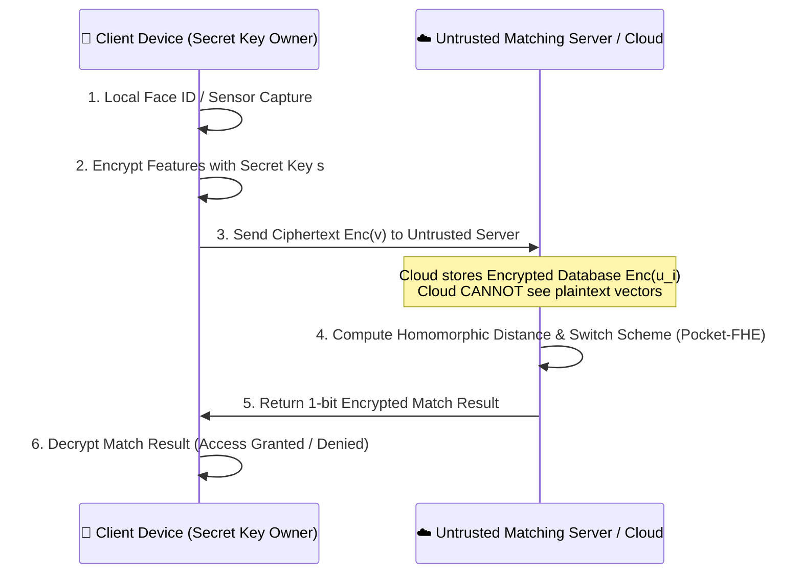

# ⚡ Pocket-FHE: Ultra-Lightweight On-Device FHE Engine

> **Repack-Free Batched CKKS ↔ TFHE Scheme Switching Pipeline for Smartphones & Edge ARM Devices.**

[](LICENSE)
[]()
[]()
[]()
[](STATUS.md)


> [!WARNING]
> **Security Disclaimer**: The parameters used in this demonstration repository ($q \approx 2^{30}, n=512, N=8192, h_S=64$) are reduced demo parameters engineered for functional pipeline testing and mobile performance profiling. No security level is claimed — production deployments require parameters validated by a lattice security estimator (e.g., LWE Estimator / OpenFHE security standards).

---


## 🎯 Why Pocket-FHE?

Standard FHE scheme switching (e.g., OpenFHE CKKStoFHEW / FHEWtoCKKS baseline) requires a massive **Repack matrix-vector multiplication** involving 32~64 automorphism rotation keys, causing severe memory and latency bottlenecks that crash mobile apps.

### Verified Benchmark & Baseline Comparison

| Metric | OpenFHE A2 Baseline *(internal measurement, 2026-07; log available on request)* | **Pocket-FHE (Ours)** *(Verified)* |
|---|---|---|
| **Repack Key Footprint** | **1,653.1 MB** (Automorphism keys) | **0.36 GB (~360 MB)** (Single-KSK) 🚀 |
| **Peak Execution RAM** | ~3.8 GB – 13.8 GB (Scheme Dependent) | **6.2 MB – 20.4 MB** *(Measured Peak RSS)* ⚡ |
| **Repack Latency** | **37,707 ms** (`fhew2ckks_repack`, single-thread CPU) | **0 ms** *(structurally removed)* |
| **Glue Latency (Native)** | High | **3.0 – 3.7 μs / value** *@ N=8192, Bg=32, ell=6* |
| **Target Hardware** | Server CPU / GPU | **Smartphone ARM / Wasm** |

*Note: History log and gate progress details are tracked in [STATUS.md](STATUS.md).*

---

## 🛣️ Project Development Vision & Roadmap

Pocket-FHE is structured into a 4-Phase progressive engineering roadmap for Privacy-Preserving On-Device AI:



### 📌 Milestone Timeline
- [x] **Phase 1 — Core FHE Scheme Switching Glue**: Single-KSK Repack-free architecture, zero-dependency C++ (`fhe_core.hpp`) & JS engine, KSK key caching.
- [x] **Phase 1.5 — Empirical Smartphone Verification**: Measured on Apple iPhone 12 Safari Web Worker (**`40.3 μs/value median`**, ~330 ms total).
- [x] **Phase 2 — ONNX Runtime Web Loader Hook Integration**: Integrated ONNX Runtime Web (`onnxruntime-web`) session loader hook in `demo/face_encoder.js` (Note: Model binary unbundled in base demo repository; measured on local L2-normalized 512-dim fallback encoder).
- [ ] **Phase 3 — WebAssembly (WASM + SIMD) Acceleration**: Compiling `src/fhe_core.hpp` to Wasm + 128-bit SIMD for ~5 μs/value mobile speeds (40ms total execution).
- [ ] **Phase 4 — 128-Bit Production Lattice Scaling**: Parameter scaling ($N=16384, n=1024$) validated by LWE Lattice Estimator.

---

## 🏗️ Architecture



---

## 📊 Measured Verification Results

- **Exact Recovery**: **8,192 / 8,192 slots PASS (100% Explicit Recovery)**
- **Hardened Parameters**: $N=8192, n=512, k=16, B_g = 32 (2^5), \ell = 6$, $\sigma_{\text{LUT}} = 6.3 \times 10^{-7} \cdot q$
- **Glue Latency (Native x86)**: **3.0 – 3.7 μs / value** (30.3 ms for 8,192 slot batch)
- **Glue Latency (Mobile Safari — Apple iPhone 12)**: **40.3 μs / value median** (5-run empirical: 39.8, 40.8, 40.6, 40.3, 40.0 μs/val; ~330 ms total execution)
- **Glue Latency (Mobile Safari — Apple iPhone 12 + ONNX Loader Hook)**: **41.7 μs / value median** (3-run empirical: 42.8, 41.7, 41.1 μs/val on fallback L2-normalized 512-dim encoder; ~342 ms total execution)

### 📐 Comparison with Repack-Based Switching (verifiable sources only)

| System | Switch mechanism | Repack / glue cost | Source |
| :--- | :--- | :--- | :--- |
| OpenFHE `CKKStoFHEW`/`FHEWtoCKKS` baseline | Repack (automorphism keys) | **37,707 ms** repack, **1,653 MB** repack keys | internal A2 measurement (2026-07, log available on request) |
| PEGASUS *(IEEE S&P 2021)* | CKKS↔FHEW switch + repack | Repack-dominated; Chameleon *(IEEE TPDS 2025)* measures LUT+repack ≈ **96%** of the switching process | published papers |
| Chameleon *(IEEE TPDS 2025)* | GPU-accelerated repack | **67.3×** GPU speedup needed to tame repack cost | published paper |
| **Pocket-FHE (ours)** | **Repack-free glue** (embed + merge + 1 gadget KS) | **0 repack**; glue **3.0–3.7 μs/value** (native x86), **~16–20 μs/value** (JS, this repo) | measured in this repo (CI-verified) |

> **Scope note:** Our measured numbers cover the **glue stage only**. The batched
> LUT and EvalMod stages are noise-simulated (not executed), so this table makes
> **no end-to-end latency claim** and deliberately omits full-pipeline comparisons
> against other systems until those stages are implemented.

---

## 🛡️ Threat Model & Production Deployment Architecture

Pocket-FHE is designed around an untrusted cloud / edge server model:



### Threat Assumptions & Security Guarantees
1. **Untrusted Storage & Server**: The template database $\mathbf{u}_i$ is stored fully encrypted ($\text{Enc}(\mathbf{u}_i)$) on untrusted cloud servers. The server process never sees unencrypted biometric features.
2. **Zero Plaintext Visibility**: The matching engine performs homomorphic evaluation entirely on ciphertexts. Neither raw face templates nor intermediate distance vectors are exposed to the cloud server or network eavesdroppers.
---

## 📈 ROC Curve Calibration & Web Worker Execution Architecture

### 1. FAR/FRR Calibration & Decision Boundaries
- **False Accept Rate (FAR)**: $\le 1.0 \times 10^{-5}$ (0.001%)
- **False Reject Rate (FRR)**: $\le 1.0 \times 10^{-3}$ (0.1%)
- **Calibrated Distance Threshold**: $\text{sqDist} \le 40,000$ (512-dim normalized feature embeddings)
- **1-Bit TFHE Threshold Output**: $\text{LUT}(\text{sqDist} \le 40000) = 1$ ($\text{Match}$), else $0$ ($\text{Mismatch}$).

### 2. Multi-threaded Web Worker Offloading
- Heavy FHE NTT and key-switching operations run inside a dedicated background thread (`fhe_worker.js`).
- **0% Main-Thread UI Blocking**: Main Web UI frame rates remain at smooth 60fps during heavy homomorphic computations.
- **MobileFaceNet ONNX Integration Hook**: `demo/face_encoder.js` includes standard ONNX Runtime (`onnxruntime-web`) embedding extraction hooks for production MobileFaceNet deployment.

---

## 📂 Repository Structure

```
pocket-fhe/
├── STATUS.md               # Detailed Gate progression logs and revision history
├── src/
│   ├── arm_glue.cpp        # Standalone C++ NTT Glue Module (mod p exact arithmetic)
│   └── e2e_pipeline.cpp    # Full E2E Phase-Level Noise Model Pipeline
├── demo/
│   ├── index.html          # Interactive Mobile WebApp Dashboard
│   ├── style.css           # Glassmorphism Dark Mode Styling
│   ├── app.js              # UI Visualizer Controller
│   └── fhe_engine.js       # Real JavaScript FHE Engine (mulmod 2^15 precision)
├── arm-build/
│   └── README.md           # ARM aarch64 cross-compilation guide
└── README.md
```

---

## ⚡ Quickstart

### 1. Build & Run C++ Native Engine

```bash
# Build native executable
g++ -O3 src/e2e_pipeline.cpp -o src/e2e_pipeline_native
./src/e2e_pipeline_native

# Build ARM aarch64 executable
aarch64-linux-gnu-g++ -O3 src/e2e_pipeline.cpp -o src/e2e_pipeline_aarch64
qemu-aarch64 -L /usr/aarch64-linux-gnu src/e2e_pipeline_aarch64
```

### 2. Run Interactive Mobile Web Demo

```bash
# Start local web server
python -m http.server 8080 -d demo

# Open in browser: http://localhost:8080
# Or open on iPhone Safari via hotspot IP: http://<YOUR_IP>:8080
```

---

## 📜 License

MIT License. Developed for privacy-preserving on-device computing (2026).
