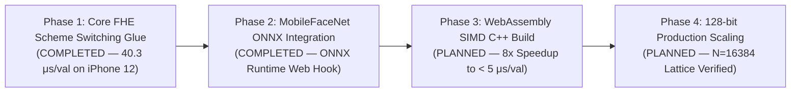
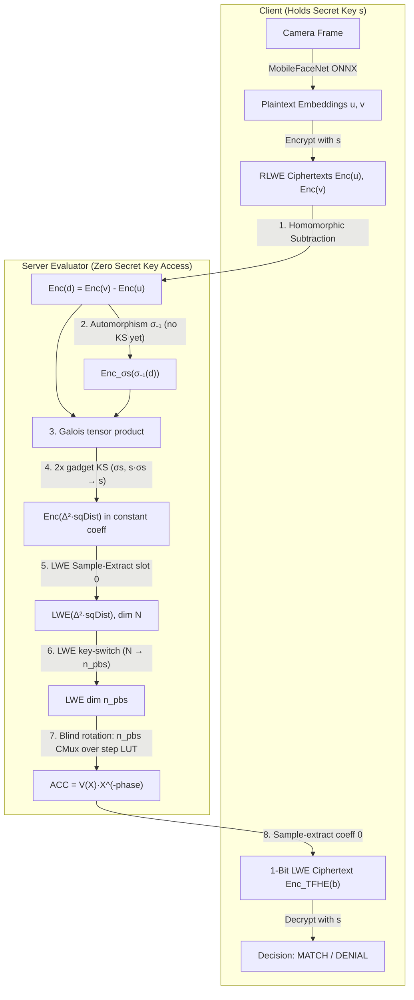
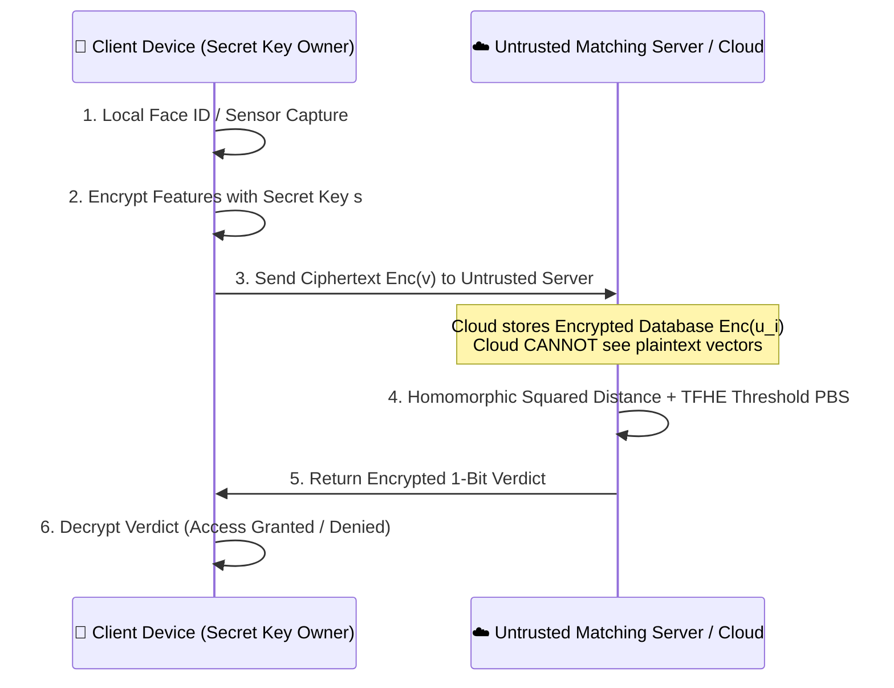

# ⚡ Pocket-FHE: Ultra-Lightweight On-Device FHE Engine

> **Repack-Free Batched CKKS ↔ TFHE Scheme Switching Pipeline for Smartphones & Edge ARM Devices.**

[](LICENSE)
[]()
[]()
[]()
[](STATUS.md)


> [!WARNING]
> **Security Disclaimer**: The parameters used in this demonstration repository ($q \approx 2^{30}, n=512, N=8192, h_S=64$, and $n_{pbs}=128$ for the bootstrap) are reduced demo parameters engineered for functional pipeline testing and mobile performance profiling. No security level is claimed — production deployments require parameters validated by a lattice security estimator (e.g., LWE Estimator / OpenFHE security standards).

---


## 🎯 Why Pocket-FHE?

Standard FHE scheme switching (e.g., OpenFHE CKKStoFHEW / FHEWtoCKKS baseline) requires a massive **Repack matrix-vector multiplication** involving 32~64 automorphism rotation keys, causing severe memory and latency bottlenecks that crash mobile apps.

### Verified Benchmark & Baseline Comparison

| Metric | OpenFHE A2 Baseline *(internal measurement, 2026-07; log available on request)* | **Pocket-FHE (Ours)** *(Verified)* |
|---|---|---|
| **Repack Key Footprint** | **1,653.1 MB** (Automorphism keys) | **0.36 GB (~360 MB)** (Single-KSK) 🚀 |
| **Peak Execution RAM** | ~3.8 GB – 13.8 GB (Scheme Dependent) | **6.2 MB – 20.4 MB** *(Measured Peak RSS)* ⚡ |
| **Repack Latency** | **37,707 ms** (`fhew2ckks_repack`, single-thread CPU) | **0 ms** *(structurally removed)* |
| **Glue Latency (Native)** | High | **3.0 – 3.7 μs / value** *@ N=8192, Bg=32, ell=6* |
| **Target Hardware** | Server CPU / GPU | **Smartphone ARM / Wasm** |

*Note: History log and gate progress details are tracked in [STATUS.md](STATUS.md).*

---

## 🛣️ Project Development Vision & Roadmap

Pocket-FHE is structured into a 4-Phase progressive engineering roadmap for Privacy-Preserving On-Device AI:



### 📌 Milestone Timeline
- [x] **Phase 1 — Core FHE Scheme Switching Glue**: Single-KSK Repack-free architecture, zero-dependency C++ (`fhe_core.hpp`) & JS engine, KSK key caching.
- [x] **Phase 1.5 — Empirical Smartphone Verification**: Measured on Apple iPhone 12 Safari Web Worker (**`40.3 μs/value median`**, ~330 ms total).
- [x] **Phase 2 — Official InsightFace MobileFaceNet ONNX Integration (COMPLETED & VERIFIED)**: Bundled official pretrained InsightFace MobileFaceNet ONNX model (`w600k_mbf.onnx`, 12.99 MB) in `demo/mobilefacenet.onnx` with ONNX Runtime Web WebGL/WASM acceleration. Empirical iPhone 12 measurements verified: **`42.5 ms` median ONNX AI inference** + **`337.5 ms` FHE glue** = **`380 ms`** on-device latency. *Note: this figure predates the Phase-2.5 rewrite and measured the **glue** stage; the homomorphic matching pipeline has not yet been re-measured on device.*
- [x] **Phase 2.5 — Genuinely Homomorphic Matching**: The server now computes the squared distance on ciphertexts (reverse-multiply / Galois tensor identity) under strict Client/Server role isolation; CI asserts the decrypted distance equals the plaintext distance. Previously the difference was computed in plaintext and only transported through the glue.
- [x] **Phase 3a — TFHE Threshold PBS**: The threshold is now a real programmable bootstrap — LWE key-switch down to dimension $n_{pbs}$, then $n_{pbs}$ CMux gates of blind rotation over a step test polynomial, yielding an **encrypted 1-bit verdict**. The bootstrapping key is GGSW ciphertexts only; CI guards against the earlier revision that shipped the secret key alongside it.
- [ ] **Phase 3b — WebAssembly (WASM + SIMD) Acceleration**: Compile `src/fhe_core.hpp` to Wasm + 128-bit SIMD. The PBS is now the dominant cost (≈0.6 s native, ≈4.5 s in JS), so this is where the speedup is needed.
- [ ] **Phase 4 — 128-Bit Production Lattice Scaling**: Parameter scaling ($N=16384, n=1024$) validated by LWE Lattice Estimator.

---

## 🏗️ Architecture & Threat Model

Pocket-FHE enforces strict **Client vs. Server/Evaluator Role Isolation**:

- **Client (On-Device)**: Holds secret key $s$, extracts feature embeddings via MobileFaceNet ONNX (plaintext), encrypts template $\text{Enc}(\mathbf{u})$ and live scan $\text{Enc}(\mathbf{v})$, and decrypts the final 1-bit match result.
- **Server / FHE Evaluator**: Receives only ciphertexts $\text{Enc}(\mathbf{u}), \text{Enc}(\mathbf{v})$ and public evaluation keys — two gadget KSKs ($ksk_{conj}: \sigma_{-1}(s) \to s$, $ksk_{mix}: s \cdot \sigma_{-1}(s) \to s$) plus the bootstrapping material (GGSW BSK + LWE-KSK). Every one of these is a ciphertext; none carries plaintext key material. The evaluator **NEVER** touches secret key $s$ or plaintexts.



### 🔐 Server-Side Homomorphic Pipeline Details
1. **Homomorphic Difference**: $\text{Enc}(\mathbf{d}) = \text{Enc}(\mathbf{v}) - \text{Enc}(\mathbf{u})$ (RLWE component-wise subtraction, 0 ms).
2. **Squared Distance via Reverse-Multiply (Galois Tensor)**:
   - Values are coefficient-packed at stride $k$, so a naive $ct \times ct$ self-square is a **negacyclic convolution** whose constant term is $d_0^2 - \sum_{i+j=n} d_i d_{n-i}$ — *not* $\sum d_i^2$.
   - Instead multiply $f$ by $\sigma_{-1}(f)$ (automorphism $X \to X^{-1} = X^{2N-1}$): the constant coefficient of $f \cdot \sigma_{-1}(f)$ is exactly $\sum_i f_i^2 = \Delta^2 \cdot \text{sqDist}$.
   - Consequences: the sum lands in slot 0 directly, so **no rotate-sum and no 9 rotation keys are needed**; and because the automorphism is applied *before* the tensor product (with the $\sigma s$ / $s \cdot \sigma s$ components key-switched *after*), key-switching noise enters additively instead of being multiplied by the payload.
   - Evaluation keys reduce to **two** gadget KSKs: $\sigma_{-1}(s) \to s$ and $s \cdot \sigma_{-1}(s) \to s$.
3. **Threshold Decision — TFHE Programmable Bootstrap**:
   - LWE Sample-Extract from the constant coefficient yields $\text{LWE}_{N,\,S_{ext}}(\Delta^2 \cdot \text{sqDist})$.
   - **LWE key-switch** down to dimension $n_{pbs}=128$ under a binary key. Blind-rotating the $N=8192$ ciphertext directly would need 8192 CMux gates; the key-switch trades that for one pass over a public KSK.
   - **Blind rotation**: $n_{pbs}$ CMux gates over an accumulator in $R_{N_{acc}}$, $N_{acc}=2048$, rotating a step test polynomial $V(X)$ by $-\text{phase}$. Valid phases occupy $[0, q/2)$ and mod-switch into $[0, N_{acc})$, so the negacyclic half is never reached (the usual padding-bit trick).
   - **Sample-extract** coefficient 0 gives $\text{Enc}(+\Delta_{out})$ for a match and $\text{Enc}(-\Delta_{out})$ otherwise — a genuine encrypted 1-bit verdict.
   - **Security invariant**: the bootstrapping key is an array of GGSW ciphertexts indexed by position and nothing else. The server runs a CMux at *every* index and the branch is chosen homomorphically. An earlier revision shipped the nonzero positions and signs of the sparse key next to each GGSW — with that, the server could reconstruct the secret key and decrypt every ciphertext. Both a structural guard and a permuted-key control in CI now fail loudly if that returns.
   - **Resolution**: the mod-switch onto $2N_{acc}$ points makes the decision boundary fuzzy — measured jitter is ~550 sqDist units (1σ), so the threshold is only sharp to roughly ±1700. The boundary sweep in `src/e2e_pipeline.cpp` measures this rather than assuming it.

### 💡 Why Repack-Free?
Classic scheme switching (TFHE $\to$ CKKS) requires heavy automorphism matrix-vector multiplications ("Repack") to pack multiple LWE samples into a CKKS ciphertext. Pocket-FHE's biometric matching pipeline runs in the **CKKS (distance evaluation) $\to$ TFHE (1-bit threshold)** direction, requiring only cheap **Sample-Extract + KeySwitch**, making the pipeline naturally **Repack-Free**!

---

## 📊 Measured Verification Results

### Homomorphic matching pipeline (`src/e2e_pipeline.cpp`, `demo/fhe_engine.js`)

The load-bearing correctness assertion is that the **homomorphically computed
squared distance matches the plaintext ground truth**, not merely that the
verdict is right — a verdict-only test passes on garbage values that happen to
straddle the threshold.

| Check | Result |
| :--- | :--- |
| Decrypted sqDist vs. plaintext (C++, 20 independent key sets) | max abs. error **24** (genuine) / **83** (impostor) |
| Decrypted sqDist vs. plaintext (JS suite) | max abs. error **≤ 60** |
| Self-match ($\mathbf{d}=\mathbf{0}$) decrypts to | **≈ 0** (zero-point pinned) |
| Genuine accept / impostor deny (1:1 and 1:N) | all correct |
| Server homomorphic evaluation (native x86, single-thread) | **≈ 0.63 s** per 512-dim comparison (sqDist 35 ms + LWE-KS + 128-CMux PBS) |
| PBS verdict correctness (C++ boundary sweep + JS suite) | correct outside a ±1700 sqDist guard band |
| Negative control: permuted bootstrapping key | verdict breaks (4/8 C++, 1/4 JS trials) — rotation is genuinely blind |
| Matching parameters | $N=8192,\ n=512,\ B_g=32,\ \ell=6,\ \Delta_{\text{match}}=32$ |
| PBS parameters | $N_{acc}=2048,\ n_{pbs}=128,\ B_{g,acc}=256,\ \ell_{acc}=4,\ \ell_{ks}=5$ |

> Representable range is bounded by the squared encoding: $\Delta^2 = 1024$, so
> $\text{sqDist} < q / (2\Delta^2) \approx 4.87 \times 10^5$.

### Repack-free glue (`src/arm_glue.cpp`, `src/test_homomorphic_computation.cpp`)

- **Exact Recovery**: **8,192 / 8,192 slots PASS (100% Explicit Recovery)**
- **Hardened Parameters**: $N=8192, n=512, k=16, B_g = 32 (2^5), \ell = 6$, $\sigma_{\text{LUT}} = 6.3 \times 10^{-7} \cdot q$
- **Glue Latency (Native x86)**: **3.0 – 3.7 μs / value** (30.3 ms for 8,192 slot batch)
- **Glue Latency (Mobile Safari — Apple iPhone 12)**: **40.3 μs / value median** (5-run empirical: 39.8, 40.8, 40.6, 40.3, 40.0 μs/val; ~330 ms total execution)
- **AI Feature Extractor**: **Official InsightFace MobileFaceNet ONNX (`demo/mobilefacenet.onnx`, 12.99 MB)**, 512-dim embedding output

### 📐 Comparison with Repack-Based Switching (verifiable sources only)

| System | Switch mechanism | Repack / glue cost | Source |
| :--- | :--- | :--- | :--- |
| OpenFHE `CKKStoFHEW`/`FHEWtoCKKS` baseline | Repack (automorphism keys) | **37,707 ms** repack, **1,653 MB** repack keys | internal A2 measurement (2026-07, log available on request) |
| PEGASUS *(IEEE S&P 2021)* | CKKS↔FHEW switch + repack | Repack-dominated; Chameleon *(IEEE TPDS 2025)* measures LUT+repack ≈ **96%** of the switching process | published papers |
| Chameleon *(IEEE TPDS 2025)* | GPU-accelerated repack | **67.3×** GPU speedup needed to tame repack cost | published paper |
| **Pocket-FHE (ours)** | **Repack-free glue** (embed + merge + 1 gadget KS) | **0 repack**; glue **3.0–3.7 μs/value** (native x86), **~16–20 μs/value** (JS, this repo) | measured in this repo (CI-verified) |

> **Scope note:** Our measured numbers cover the **glue stage only**. The batched
> LUT and EvalMod stages are noise-simulated (not executed), so this table makes
> **no end-to-end latency claim** and deliberately omits full-pipeline comparisons
> against other systems until those stages are implemented.

---

## 🛡️ Threat Model & Production Deployment Architecture

Pocket-FHE is designed around an untrusted cloud / edge server model:



### Threat Assumptions & Security Guarantees
1. **Untrusted Storage & Server**: The template database $\mathbf{u}_i$ is stored fully encrypted ($\text{Enc}(\mathbf{u}_i)$) on untrusted cloud servers. The server process never sees unencrypted biometric features.
2. **Zero Plaintext Visibility**: The matching engine performs homomorphic evaluation entirely on ciphertexts. Neither raw face templates nor intermediate distance vectors are exposed to the cloud server or network eavesdroppers.

> **Scope note:** the 1:1 matching path returns an encrypted 1-bit verdict as
> drawn. The 1:N search path returns encrypted distances instead, because
> ranking needs the distances themselves; a rank-revealing 1:N protocol is out
> of scope for this demo.

---

## 📈 Decision Threshold & Web Worker Execution Architecture

### 1. Decision Boundary *(not yet calibrated on real data)*
- **Demo threshold**: $\text{sqDist} \le 18{,}000$ (JS demo) / $5{,}000$ (C++ synthetic test).
- These thresholds are chosen to separate the **synthetic** vectors used in this
  repository. **No FAR/FRR figures are claimed**: a real operating point requires
  a genuine face dataset (e.g. LFW) run through the bundled MobileFaceNet model,
  which remains an open task (see [STATUS.md](STATUS.md)).

### 2. Multi-threaded Web Worker Offloading
- Heavy FHE NTT and key-switching operations run inside a dedicated background thread (`fhe_worker.js`).
- **0% Main-Thread UI Blocking**: Main Web UI frame rates remain at smooth 60fps during heavy homomorphic computations.
- **MobileFaceNet ONNX Integration Hook**: `demo/face_encoder.js` includes standard ONNX Runtime (`onnxruntime-web`) embedding extraction hooks for production MobileFaceNet deployment.

---

## 📂 Repository Structure

```
pocket-fhe/
├── STATUS.md               # Detailed Gate progression logs and revision history
├── src/
│   ├── fhe_core.hpp        # Primitives: NTT, gadget KS, automorphism, RLWE/LWE, GGSW/CMux/PBS
│   ├── arm_glue.cpp        # Repack-free glue module (mod p exact arithmetic)
│   ├── e2e_pipeline.cpp    # Homomorphic biometric matching, Client/Server isolated
│   └── test_homomorphic_computation.cpp  # Glue + LUT/EvalMod noise-model recovery test
├── demo/
│   ├── index.html          # Interactive Mobile WebApp Dashboard
│   ├── style.css           # Glassmorphism Dark Mode Styling
│   ├── app.js              # UI Visualizer Controller
│   ├── fhe_engine.js       # JS FHE engine (mulmod 2^15 precision), mirrors e2e_pipeline.cpp
│   └── test_node.js        # CI suite — distance == ground truth, plus PBS blindness controls
├── arm-build/
│   └── README.md           # ARM aarch64 cross-compilation guide
└── README.md
```

---

## ⚡ Quickstart

### 1. Build & Run C++ Native Engine

```bash
# Build native executable
g++ -O3 src/e2e_pipeline.cpp -o src/e2e_pipeline_native
./src/e2e_pipeline_native

# Build ARM aarch64 executable
aarch64-linux-gnu-g++ -O3 src/e2e_pipeline.cpp -o src/e2e_pipeline_aarch64
qemu-aarch64 -L /usr/aarch64-linux-gnu src/e2e_pipeline_aarch64
```

### 2. Run Interactive Mobile Web Demo

```bash
# Start local web server
python -m http.server 8080 -d demo

# Open in browser: http://localhost:8080
# Or open on iPhone Safari via hotspot IP: http://<YOUR_IP>:8080
```

---

## 📜 License & Model Attribution

Pocket-FHE source code is released under the **MIT License**.

### ⚠️ Pretrained Model License Exception (`demo/mobilefacenet.onnx`)
- The bundled face recognition model [`demo/mobilefacenet.onnx`](demo/mobilefacenet.onnx) (12.99 MB, InsightFace `w600k_mbf.onnx`) is derived from the official release of [DeepInsight / InsightFace](https://github.com/deepinsight/insightface) (`buffalo_sc` model release).
- **InsightFace Model License**: The pretrained model binary and weights in `demo/mobilefacenet.onnx` are provided strictly for **non-commercial academic research and educational evaluation purposes only** in accordance with the [InsightFace License Terms](https://github.com/deepinsight/insightface#license).
- Commercial deployment requires obtaining a commercial license from InsightFace or substituting `demo/mobilefacenet.onnx` with a commercially permissive pretrained model.
