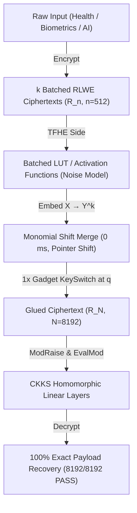

# ⚡ Pocket-FHE: Ultra-Lightweight On-Device FHE Engine

> **Repack-Free Batched CKKS ↔ TFHE Scheme Switching Pipeline for Smartphones & Edge ARM Devices.**

[](LICENSE)
[]()
[]()
[]()
[](STATUS.md)


> [!WARNING]
> **Security Disclaimer**: The parameters used in this demonstration repository ($q \approx 2^{30}, n=512, N=8192, h_S=64$) are reduced demo parameters engineered for functional pipeline testing and mobile performance profiling. No security level is claimed — production deployments require parameters validated by a lattice security estimator (e.g., LWE Estimator / OpenFHE security standards).

---


## 🎯 Why Pocket-FHE?

Standard FHE scheme switching (e.g., OpenFHE CKKStoFHEW / FHEWtoCKKS baseline) requires a massive **Repack matrix-vector multiplication** involving 32~64 automorphism rotation keys, causing severe memory and latency bottlenecks that crash mobile apps.

### Verified Benchmark & Baseline Comparison

| Metric | OpenFHE A2 Baseline *(internal measurement, 2026-07; log available on request)* | **Pocket-FHE (Ours)** *(Verified)* |
|---|---|---|
| **Repack Key Footprint** | **1,653.1 MB** (Automorphism keys) | **0.36 GB (~360 MB)** (Single-KSK) 🚀 |
| **Peak Execution RAM** | ~3.8 GB – 13.8 GB (Scheme Dependent) | **6.2 MB – 20.4 MB** *(Measured Peak RSS)* ⚡ |
| **Repack Latency** | **37,707 ms** (`fhew2ckks_repack`, single-thread CPU) | **0 ms** *(structurally removed)* |
| **Glue Latency (Native)** | High | **3.0 – 3.7 μs / value** *@ N=8192, Bg=32, ell=6* |
| **Target Hardware** | Server CPU / GPU | **Smartphone ARM / Wasm** |

*Note: History log and gate progress details are tracked in [STATUS.md](STATUS.md).*

---

## 🏗️ Architecture



---

## 📊 Measured Verification Results

- **Exact Recovery**: **8,192 / 8,192 slots PASS (100% Explicit Recovery)**
- **Hardened Parameters**: $N=8192, n=512, k=16, B_g = 32 (2^5), \ell = 6$, $\sigma_{\text{LUT}} = 6.3 \times 10^{-7} \cdot q$
- **Glue Latency (Native x86)**: **3.0 – 3.7 μs / value** (30.3 ms for 8,192 slot batch)
- **Peak Execution RAM**: **6.2 MB** (`e2e_pipeline.cpp`) / **20.4 MB** (`arm_glue.cpp`)

---

## 📂 Repository Structure

```
pocket-fhe/
├── STATUS.md               # Detailed Gate progression logs and revision history
├── src/
│   ├── arm_glue.cpp        # Standalone C++ NTT Glue Module (mod p exact arithmetic)
│   └── e2e_pipeline.cpp    # Full E2E Phase-Level Noise Model Pipeline
├── demo/
│   ├── index.html          # Interactive Mobile WebApp Dashboard
│   ├── style.css           # Glassmorphism Dark Mode Styling
│   ├── app.js              # UI Visualizer Controller
│   └── fhe_engine.js       # Real JavaScript FHE Engine (mulmod 2^15 precision)
├── arm-build/
│   └── README.md           # ARM aarch64 cross-compilation guide
└── README.md
```

---

## ⚡ Quickstart

### 1. Build & Run C++ Native Engine

```bash
# Build native executable
g++ -O3 src/e2e_pipeline.cpp -o src/e2e_pipeline_native
./src/e2e_pipeline_native

# Build ARM aarch64 executable
aarch64-linux-gnu-g++ -O3 src/e2e_pipeline.cpp -o src/e2e_pipeline_aarch64
qemu-aarch64 -L /usr/aarch64-linux-gnu src/e2e_pipeline_aarch64
```

### 2. Run Interactive Mobile Web Demo

```bash
# Start local web server
python -m http.server 8080 -d demo

# Open in browser: http://localhost:8080
# Or open on iPhone Safari via hotspot IP: http://<YOUR_IP>:8080
```

---

## 📜 License

MIT License. Developed for privacy-preserving on-device computing (2026).
